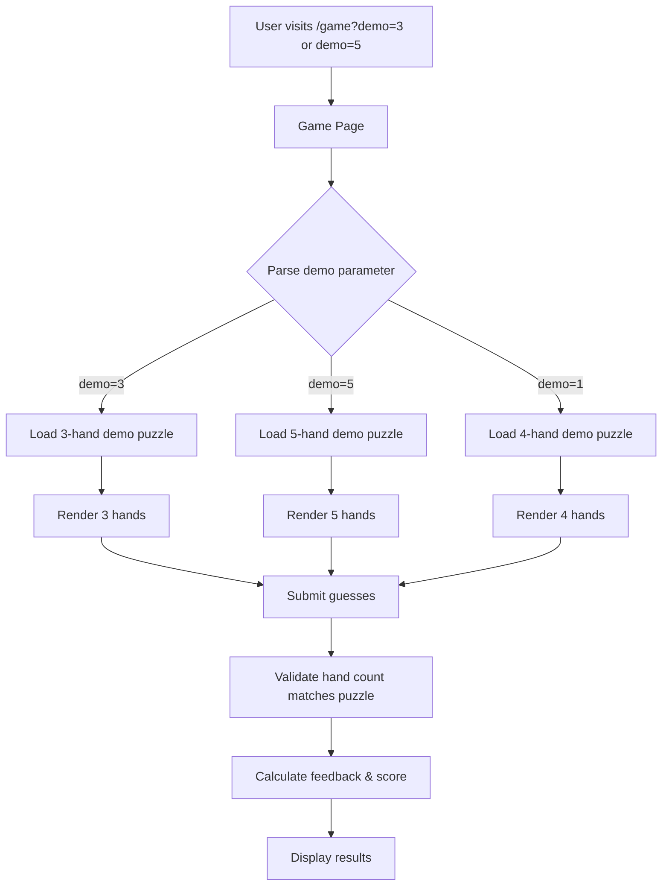
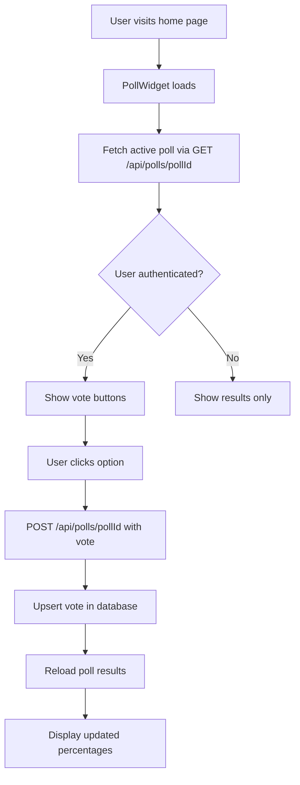
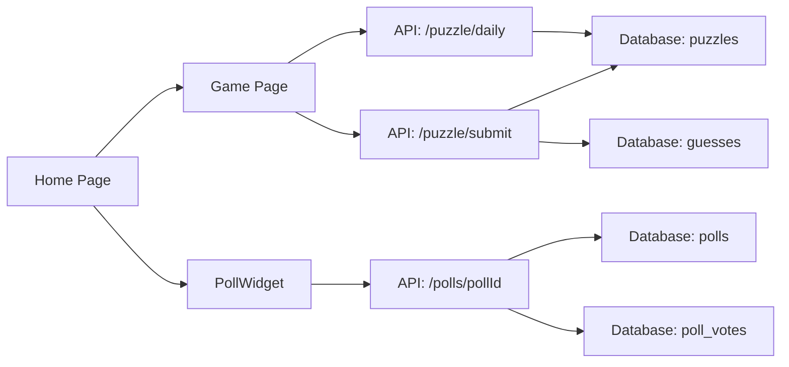
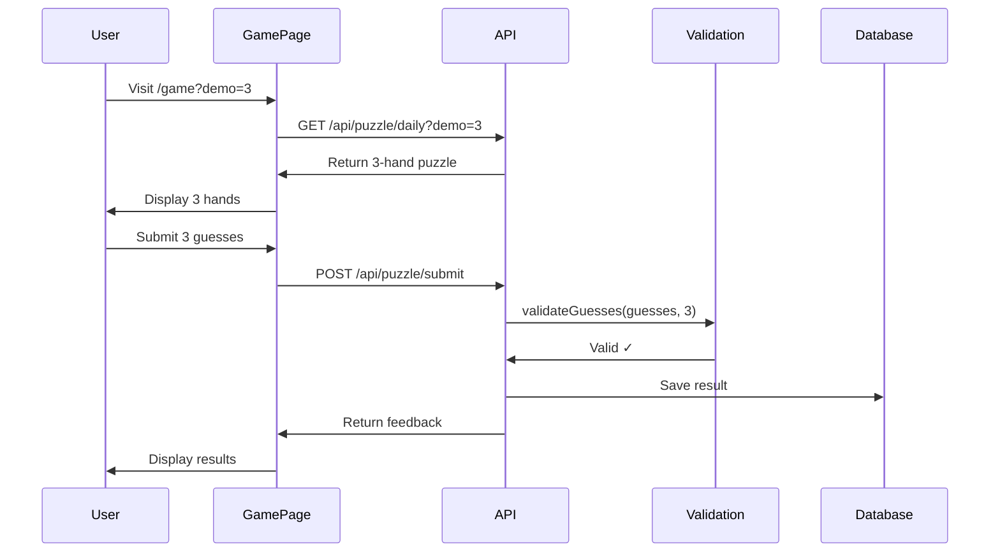

# Technical Specification: Multi-Hand Modes & Community Polls

**Project:** Hold'emle (Poker Wordle)  
**Date:** 2026-03-08  
**Author:** Bob (Planning Mode)

---

## Table of Contents

1. [Executive Summary](#executive-summary)
2. [Feature 1: Demo3 & Demo5 (3-Hand and 5-Hand Games)](#feature-1-demo3--demo5-3-hand-and-5-hand-games)
3. [Feature 2: Community Poll System](#feature-2-community-poll-system)
4. [Database Schema Analysis](#database-schema-analysis)
5. [Implementation Roadmap](#implementation-roadmap)
6. [Risk Assessment](#risk-assessment)
7. [Testing Strategy](#testing-strategy)

---

## Executive Summary

This specification covers three main objectives:

1. **Understanding the current codebase** - Completed ✓
2. **Adding 3-hand and 5-hand demo modes** - Enables testing different game variations
3. **Implementing community polls** - Allows user feedback collection

### Key Findings

#### Current Architecture
- **Game Mode:** Currently hardcoded for 4 hands
- **Database:** JSONB fields support variable hand counts (no schema changes needed)
- **Validation:** Hardcoded to expect exactly 4 guesses
- **UI Components:** Grid layout assumes 4 columns (`grid-cols-4`)
- **Scoring:** Based on MAX_GUESSES (5) - works for any hand count

#### Feasibility Assessment

| Feature | Feasibility | Complexity | Database Changes |
|---------|-------------|------------|------------------|
| Demo3 (3 hands) | ✅ High | Low | None required |
| Demo5 (5 hands) | ✅ High | Medium | None required |
| Daily 3-hand puzzles | ⚠️ Medium | Medium | Optional: mode field |
| Daily 5-hand puzzles | ⚠️ Medium | Medium | Optional: mode field |
| Community Polls | ✅ High | Low | New tables required |

---

## Feature 1: Demo3 & Demo5 (3-Hand and 5-Hand Games)

### 1.1 Architecture Overview



### 1.2 URL Structure

```
/game?demo=1   → 4-hand demo (existing)
/game?demo=3   → 3-hand demo (new)
/game?demo=5   → 5-hand demo (new)
/game          → Daily puzzle (4 hands currently)
```

### 1.3 Files Requiring Modification

#### Core Logic Files

1. **`lib/demo-mode.ts`** (Minor)
   - Add support for demo mode variants (demo=3, demo=5)
   - Current: Returns boolean for demo mode
   - Change: Return demo mode type or false

2. **`lib/poker/hand-families.ts`** (Medium)
   - Current: `generateFourHandsWithFamilies()`
   - Add: `generateNHandsWithFamilies(n: number)`
   - Supports 3, 4, or 5 hands

3. **`lib/poker/odds-calculator.ts`** (Already flexible!)
   - ✅ `calculatePreFlopOddsExhaustive()` accepts `Array<[string, string]>`
   - ✅ Already supports variable hand counts
   - No changes needed

4. **`lib/utils/validation.ts`** (Critical)
   - Current: Hardcoded `guesses.length !== 4`
   - Change: Accept expected hand count parameter
   ```typescript
   export function validateGuesses(
     guesses: Array<{ position: number; percent: number }>,
     expectedHandCount: number = 4
   ): { valid: boolean; error?: string }
   ```

5. **`lib/game-config.ts`** (Optional)
   - Consider adding: `HAND_COUNT_OPTIONS = [3, 4, 5]`
   - Keep MAX_GUESSES = 5 (works for all modes)

#### API Routes

6. **`app/api/puzzle/daily/route.ts`** (Medium)
   - Add DEMO3_PUZZLE and DEMO5_PUZZLE constants
   - Parse `demo` parameter: "1", "3", "5"
   - Return appropriate puzzle based on demo mode

7. **`app/api/puzzle/submit/route.ts`** (Critical)
   - Extract hand count from puzzle data
   - Pass to `validateGuesses(guesses, handCount)`
   - Update demo puzzle validation for 3 and 5 hands

#### Frontend Components

8. **`components/PokerHand.tsx`** (No changes needed!)
   - ✅ Already flexible - renders individual hands
   - Works with any number of hands

9. **`components/ResultsDisplay.tsx`** (Critical)
   - Current: `grid-cols-4` hardcoded
   - Change: Dynamic grid columns based on hand count
   ```tsx
   const gridCols = hands.length === 3 ? 'grid-cols-3' : 
                    hands.length === 5 ? 'grid-cols-5' : 
                    'grid-cols-4';
   ```

10. **`app/game/page.tsx`** (Medium)
    - Parse demo parameter (1, 3, or 5)
    - Pass to API calls
    - Adjust initial guess state based on hand count

11. **`app/page.tsx`** (Minor)
    - Add buttons for "Try Demo (3 hands)" and "Try Demo (5 hands)"
    - Links: `/game?demo=3` and `/game?demo=5`

### 1.4 Demo Puzzle Data

#### Demo3 Puzzle (3 hands)
```typescript
const DEMO3_PUZZLE = {
  id: "demo3-puzzle",
  puzzle_date: new Date().toISOString().split("T")[0],
  hands: [
    { position: 1, cards: ["As", "Ah"], actualPercent: 45 }, // Pocket Aces
    { position: 2, cards: ["Kd", "Kc"], actualPercent: 35 }, // Pocket Kings
    { position: 3, cards: ["Qh", "Js"], actualPercent: 20 }, // QJ suited
  ],
  difficulty: "easy",
};
```

#### Demo5 Puzzle (5 hands)
```typescript
const DEMO5_PUZZLE = {
  id: "demo5-puzzle",
  puzzle_date: new Date().toISOString().split("T")[0],
  hands: [
    { position: 1, cards: ["As", "Kh"], actualPercent: 24 }, // AK offsuit
    { position: 2, cards: ["Qd", "Qc"], actualPercent: 28 }, // Pocket Queens
    { position: 3, cards: ["Jh", "Js"], actualPercent: 18 }, // Pocket Jacks
    { position: 4, cards: ["Tc", "9c"], actualPercent: 16 }, // T9 suited
    { position: 5, cards: ["7d", "7h"], actualPercent: 14 }, // Pocket 7s
  ],
  difficulty: "hard",
};
```

**Note:** Actual percentages must be calculated using `calculatePreFlopOddsExhaustive()` to ensure accuracy.

### 1.5 Responsive Design Considerations

#### 3-Hand Layout
- Desktop: 3 columns, plenty of space
- Mobile: May need to adjust card sizes slightly
- Grid: `grid-cols-3` works well on all screen sizes

#### 5-Hand Layout
- Desktop: 5 columns, tighter spacing
- Tablet: May need 2 rows (3 + 2)
- Mobile: Definitely needs vertical stacking or smaller cards
- Consider: `grid-cols-2 sm:grid-cols-3 lg:grid-cols-5`

### 1.6 Database Compatibility

#### Current Schema Analysis

**`puzzles` table:**
```sql
hands JSONB NOT NULL
```
✅ **Compatible** - JSONB can store any number of hands

**`guesses` table:**
```sql
guess_history JSONB NOT NULL
```
✅ **Compatible** - JSONB stores variable-length arrays

**`user_stats` table:**
```sql
solved_in_one INTEGER DEFAULT 0,
solved_in_two INTEGER DEFAULT 0,
solved_in_three INTEGER DEFAULT 0,
```
✅ **Compatible** - These track guess attempts (1-5), not hand count

#### Daily Puzzle Considerations

**Option A: Single Mode (Recommended for MVP)**
- Keep daily puzzles as 4-hand only
- Use 3-hand and 5-hand for demos only
- No database changes needed

**Option B: Multi-Mode Daily Puzzles (Future Enhancement)**
- Add `mode` field to puzzles table: `'3-hand' | '4-hand' | '5-hand'`
- Add `mode` field to guesses table for filtering
- Update leaderboard to separate by mode
- Migration required:
```sql
ALTER TABLE puzzles ADD COLUMN mode TEXT DEFAULT '4-hand';
ALTER TABLE guesses ADD COLUMN mode TEXT;
```

**Recommendation:** Start with Option A (demos only), evaluate user feedback before implementing Option B.

---

## Feature 2: Community Poll System

### 2.1 Architecture Overview



### 2.2 Database Schema

#### New Tables

**`polls` table:**
```sql
CREATE TABLE polls (
  id UUID PRIMARY KEY DEFAULT uuid_generate_v4(),
  question TEXT NOT NULL,
  options JSONB NOT NULL, -- ["Option 1", "Option 2", "Option 3"]
  is_active BOOLEAN NOT NULL DEFAULT true,
  created_at TIMESTAMPTZ DEFAULT NOW(),
  updated_at TIMESTAMPTZ DEFAULT NOW()
);

CREATE INDEX idx_polls_is_active ON polls(is_active);
CREATE INDEX idx_polls_created_at ON polls(created_at DESC);
```

**`poll_votes` table:**
```sql
CREATE TABLE poll_votes (
  id UUID PRIMARY KEY DEFAULT uuid_generate_v4(),
  poll_id UUID NOT NULL REFERENCES polls(id) ON DELETE CASCADE,
  user_id UUID NOT NULL REFERENCES auth.users(id) ON DELETE CASCADE,
  option TEXT NOT NULL,
  voted_at TIMESTAMPTZ DEFAULT NOW(),
  UNIQUE(poll_id, user_id) -- One vote per user per poll
);

CREATE INDEX idx_poll_votes_poll_id ON poll_votes(poll_id);
CREATE INDEX idx_poll_votes_user_id ON poll_votes(user_id);
```

#### RLS Policies

```sql
-- Polls: Everyone can read active polls
CREATE POLICY "Anyone can view active polls"
  ON polls FOR SELECT
  USING (is_active = true);

-- Poll Votes: Everyone can read (for aggregation)
CREATE POLICY "Anyone can view poll votes"
  ON poll_votes FOR SELECT
  USING (true);

-- Poll Votes: Authenticated users can insert/update their own votes
CREATE POLICY "Authenticated users can vote"
  ON poll_votes FOR INSERT
  WITH CHECK (auth.uid() = user_id);

CREATE POLICY "Users can update their own votes"
  ON poll_votes FOR UPDATE
  USING (auth.uid() = user_id);
```

### 2.3 API Endpoints

#### GET `/api/polls/[pollId]`

**Response:**
```json
{
  "poll": {
    "id": "uuid",
    "question": "Should we add 3-hand and 5-hand daily puzzles?",
    "options": ["Yes, both!", "Only 3-hand", "Only 5-hand", "No, keep 4-hand only"]
  },
  "results": {
    "voteCounts": {
      "Yes, both!": 45,
      "Only 3-hand": 12,
      "Only 5-hand": 8,
      "No, keep 4-hand only": 23
    },
    "totalVotes": 88
  }
}
```

#### POST `/api/polls/[pollId]`

**Request:**
```json
{
  "option": "Yes, both!"
}
```

**Response:**
```json
{
  "success": true
}
```

### 2.4 Frontend Component

**`components/PollWidget.tsx`** (Adapted from Rift)

Key features:
- Fetches poll data on mount
- Shows vote buttons for authenticated users
- Shows results-only for anonymous users
- Displays bar chart with percentages
- Allows users to change their vote
- Real-time result updates after voting

**Styling adjustments for poker-wordle:**
- Use poker-wordle color scheme (green, blue, orange)
- Match existing button styles
- Responsive design for mobile/desktop
- Dark mode support

### 2.5 Integration Points

**Home page (`app/page.tsx`):**
```tsx
import PollWidget from "@/components/PollWidget";

// Add after DailyPlaysChart
<PollWidget pollId="a0000000-0000-0000-0000-000000000001" />
```

### 2.6 Initial Poll Question

**Suggested first poll:**
```
Question: "Should we add 3-hand and 5-hand daily puzzles?"
Options:
- "Yes, both!"
- "Only 3-hand"
- "Only 5-hand"
- "No, keep 4-hand only"
```

This directly ties into Feature 1 and provides valuable user feedback!

---

## Database Schema Analysis

### Current Schema Compatibility

| Table | Field | Type | 3-Hand | 5-Hand | Notes |
|-------|-------|------|--------|--------|-------|
| `puzzles` | `hands` | JSONB | ✅ | ✅ | Flexible array |
| `guesses` | `guess_history` | JSONB | ✅ | ✅ | Flexible array |
| `guesses` | `guesses_used` | INTEGER | ✅ | ✅ | Tracks attempts (1-5) |
| `user_stats` | `solved_in_*` | INTEGER | ✅ | ✅ | Tracks by attempt count |

### Required Migrations

**For Demo3/Demo5 (demos only):**
- ✅ **No migrations required!**

**For Multi-Mode Daily Puzzles (optional future):**
```sql
-- Migration: 016_add_puzzle_mode.sql
ALTER TABLE puzzles ADD COLUMN mode TEXT DEFAULT '4-hand';
ALTER TABLE guesses ADD COLUMN mode TEXT;
CREATE INDEX idx_puzzles_mode ON puzzles(mode);
CREATE INDEX idx_guesses_mode ON guesses(mode);
```

**For Community Polls:**
```sql
-- Migration: 017_add_polls.sql (or 016 if not doing multi-mode)
-- See section 2.2 for full schema
```

---

## Implementation Roadmap

### Phase 1: Demo3 & Demo5 (Estimated: 4-6 hours)

1. **Core Logic** (1-2 hours)
   - Update `validation.ts` to accept hand count parameter
   - Add `generateNHandsWithFamilies()` to `hand-families.ts`
   - Calculate demo3 and demo5 puzzle percentages

2. **API Routes** (1 hour)
   - Add DEMO3_PUZZLE and DEMO5_PUZZLE to `daily/route.ts`
   - Update submit validation to use puzzle hand count

3. **Frontend** (2-3 hours)
   - Update `ResultsDisplay.tsx` for dynamic grid columns
   - Update `game/page.tsx` to handle demo parameter
   - Add demo3/demo5 buttons to home page
   - Test responsive layouts

### Phase 2: Community Polls (Estimated: 3-4 hours)

1. **Database** (30 minutes)
   - Create migration file
   - Run migration
   - Seed initial poll

2. **API Routes** (1 hour)
   - Create `/api/polls/[pollId]/route.ts`
   - Implement GET and POST handlers
   - Add authentication and validation

3. **Frontend** (1.5-2 hours)
   - Create `PollWidget.tsx` component
   - Style to match poker-wordle theme
   - Integrate into home page

4. **Testing** (30 minutes)
   - Test voting flow
   - Test anonymous vs authenticated views
   - Test vote updates

### Phase 3: Testing & Documentation (Estimated: 2-3 hours)

1. **End-to-End Testing**
   - Test demo3 complete flow
   - Test demo5 complete flow
   - Test poll voting and results
   - Mobile/desktop responsive testing

2. **Documentation**
   - Update README.md
   - Update version.json
   - Create poll management guide
   - Document demo modes

**Total Estimated Time: 9-13 hours**

---

## Risk Assessment

### High Priority Risks

| Risk | Impact | Probability | Mitigation |
|------|--------|-------------|------------|
| UI breaks on mobile with 5 hands | High | Medium | Implement responsive grid, test early |
| Validation fails for variable hand counts | High | Low | Comprehensive unit tests |
| Poll votes not updating in real-time | Medium | Low | Reload poll after vote submission |

### Medium Priority Risks

| Risk | Impact | Probability | Mitigation |
|------|--------|-------------|------------|
| Demo percentages don't sum to 100 | Medium | Low | Use `roundToSum100()` utility |
| Users confused by multiple demo modes | Medium | Medium | Clear labeling and instructions |
| Poll spam/abuse | Medium | Medium | Rate limiting (future enhancement) |

### Low Priority Risks

| Risk | Impact | Probability | Mitigation |
|------|--------|-------------|------------|
| Performance issues with 5-hand calculations | Low | Low | Already using exhaustive method |
| Database storage concerns | Low | Very Low | JSONB is efficient |

---

## Testing Strategy

### Unit Tests

1. **`validation.ts`**
   - Test with 3, 4, and 5 hands
   - Test sum validation
   - Test range validation

2. **`hand-families.ts`**
   - Test generating 3 hands
   - Test generating 5 hands
   - Test no card overlap

3. **`odds-calculator.ts`**
   - Verify 3-hand calculations
   - Verify 5-hand calculations
   - Verify percentages sum to 100

### Integration Tests

1. **Demo3 Flow**
   - Load `/game?demo=3`
   - Submit valid guesses
   - Verify results display

2. **Demo5 Flow**
   - Load `/game?demo=5`
   - Submit valid guesses
   - Verify results display

3. **Poll Flow**
   - Load home page
   - View poll as anonymous
   - Sign in and vote
   - Change vote
   - Verify results update

### Manual Testing Checklist

- [ ] Demo3 loads correctly
- [ ] Demo3 accepts 3 guesses summing to 100
- [ ] Demo3 rejects 4 guesses
- [ ] Demo3 displays results correctly
- [ ] Demo5 loads correctly
- [ ] Demo5 accepts 5 guesses summing to 100
- [ ] Demo5 rejects 4 guesses
- [ ] Demo5 displays results correctly
- [ ] Demo5 responsive on mobile
- [ ] Poll displays for anonymous users
- [ ] Poll allows voting for authenticated users
- [ ] Poll updates results after voting
- [ ] Poll allows changing vote
- [ ] Poll displays correctly on mobile
- [ ] Existing 4-hand demo still works
- [ ] Daily puzzle (4-hand) still works

---

## Appendix A: File Change Summary

### Files to Modify (Demo3/Demo5)

| File | Change Type | Complexity |
|------|-------------|------------|
| `lib/utils/validation.ts` | Modify | Low |
| `lib/poker/hand-families.ts` | Add function | Medium |
| `lib/demo-mode.ts` | Modify | Low |
| `app/api/puzzle/daily/route.ts` | Add constants | Low |
| `app/api/puzzle/submit/route.ts` | Modify validation | Medium |
| `components/ResultsDisplay.tsx` | Dynamic grid | Medium |
| `app/game/page.tsx` | Parse demo param | Low |
| `app/page.tsx` | Add buttons | Low |

### Files to Create (Polls)

| File | Purpose |
|------|---------|
| `supabase/migrations/017_add_polls.sql` | Database schema |
| `app/api/polls/[pollId]/route.ts` | API endpoints |
| `components/PollWidget.tsx` | Poll UI component |

---

## Appendix B: Mermaid Diagrams

### Component Interaction Diagram



### Data Flow: Variable Hand Count



---

## Conclusion

This specification provides a comprehensive plan for implementing:

1. ✅ **Demo3 & Demo5 modes** - Fully feasible with minimal database impact
2. ✅ **Community polls** - Straightforward implementation using proven patterns from Rift
3. ⚠️ **Daily multi-mode puzzles** - Recommended as future enhancement after user feedback

**Next Steps:**
1. Review and approve this specification
2. Switch to Code mode for implementation
3. Follow the implementation roadmap in phases
4. Test thoroughly at each phase
5. Deploy and gather user feedback via the poll system!

---

*Document created by Bob (Planning Mode) - Ready for implementation*